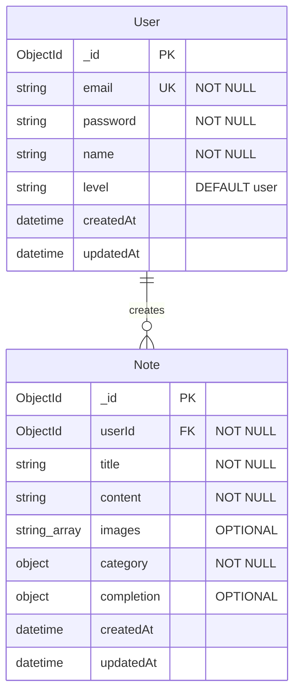

# 🧠 Tidy Mind

AI 기반 개인 메모 및 할 일 관리 애플리케이션의 백엔드 API 서버

> 빠르게 메모하고, 자동으로 분류되며, 실행 가능한 형태로 정리되는 생산성 애플리케이션의 백엔드

---

## 🔗 Demo

- [Frontend Demo](https://tidymind-ai.vercel.app/)

---

## 📌 Features

### 🔐 인증 시스템

- **JWT 기반 인증**: Stateless 토큰 기반 사용자 인증 (1일 만료)
- **이메일/비밀번호 로그인**: bcrypt를 사용한 안전한 비밀번호 해싱 (Salt 10 라운드)
- **Google OAuth**: Google 계정을 통한 소셜 로그인 지원 (`google-auth-library`)
- **토큰 검증 미들웨어**: 자동 토큰 갱신 및 사용자 정보 하이드레이션

### 🧠 AI 기반 메모 처리

- **자동 분류**: OpenAI GPT-4o-mini를 사용한 지능형 카테고리 분류
- **이미지 분석**: Cloudinary 연동으로 이미지 업로드 및 AI 비전 분석
- **스마트 제목 생성**: 컨텐츠 기반 자동 제목 생성
- **우선순위 할당**: AI가 분석한 우선순위에 따른 마감일 자동 설정 
- **다국어 지원**: 한국어/영어 입력에 따른 적절한 응답 생성
### 📚 노트 관리

- **CRUD 작업**: 완전한 노트 생성, 조회, 수정, 삭제 기능
- **카테고리 시스템**: Task, Reminder, Idea, Work, Goal, Personal, Other
- **완료 상태 관리**: Task/Reminder 카테고리의 마감일 및 완료 상태 추적
- **이미지 최적화**: Cloudinary를 통한 이미지 업로드 및 자동 최적화 
- **통계 데이터**: 월별 히트맵을 위한 완료 데이터 집계 API

### 🛡️ 보안 및 검증

- **입력 검증**: 이메일 정규식, 비밀번호 복잡성 검사 (8-20자, 영문+숫자)
- **권한 관리**: 사용자별 데이터 격리 및 소유권 검증 (`userId` 기반)
- **에러 핸들링**: 체계적인 에러 코드 및 다국어 메시지 응답
- **API 보안**: Rate limiting 대비 및 CORS 설정

---

## ⚙️ Tech Stack

| 항목           | 기술                                     |용도                      |
| -------------- | ---------------------------------------- |  ------------------------- |
| **Runtime**    | Node.js                                  |서버 런타임 환경          |
| **Framework**  | Express.js                               |웹 프레임워크 및 API 서버 |
| **Database**   | MongoDB                                  |NoSQL 문서 데이터베이스   |
| **ODM**        | Mongoose                                 |MongoDB 객체 모델링       |
| **AI**         | OpenAI GPT-4o-mini                       |AI 기반 메모 분석 및 분류 |
| **AI SDK**     | @ai-sdk/openai, ai                       |OpenAI API 통합           |
| **Auth**       | jsonwebtoken                             |JWT 토큰 기반 인증        |
| **Password**   | bcryptjs                                 |비밀번호 해싱             |
| **OAuth**      | google-auth-library                      |Google 소셜 로그인        |
| **Image**      | Cloudinary                               |이미지 업로드 및 최적화   |
| **Validation** | Custom validators                        |입력 데이터 검증          |
| **Linting**    | ESLint, Prettier, Husky, lint-staged    |코드 품질 관리            |

---

## 🏗️ Architecture

### 프로젝트 구조

### 데이터베이스 ERD

## 🤖 AI Features

### 카테고리 자동 분류
- **Task**: 구체적인 작업 항목, 할 일
- **Reminder**: 시간 민감한 항목, 약속
- **Idea**: 창의적 생각, 브레인스토밍
- **Work**: 전문적 활동, 비즈니스 프로젝트
- **Goal**: 장기 목표, 미래 계획
- **Personal**: 개인 생활, 취미, 관계
- **Other**: 기타 분류되지 않는 항목

### 우선순위 시스템
- **High**: 긴급/중요 → 1일 후 마감
- **Medium**: 중요하지만 긴급하지 않음 → 3일 후 마감
- **Low**: 연기 가능 → 7일 후 마감

### 언어 처리
- 사용자 입력 언어 자동 감지
- 한국어 입력 시 한국어 제목 생성
- 영어 입력 시 영어 제목 생성
- 언어 간 번역 금지 (원본 언어 유지)

---

## 👤 Contributors

- [bytesbyt](https://github.com/bytesbyt)
- [ihj04982](https://github.com/ihj04982)
- [JiHy0ung](https://github.com/JiHy0ung)
- [junsu0573](https://github.com/junsu0573)
